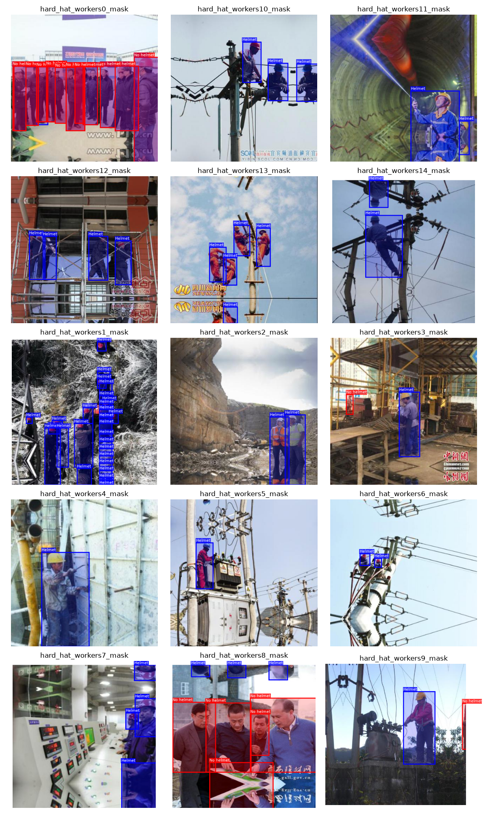
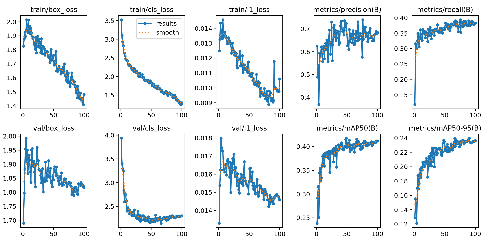
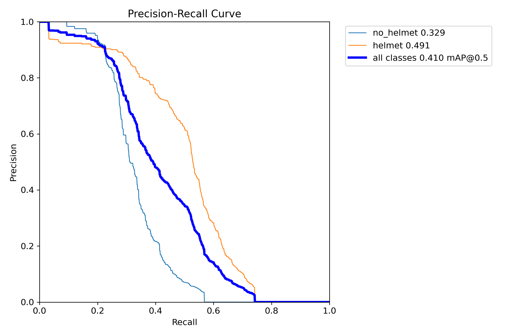
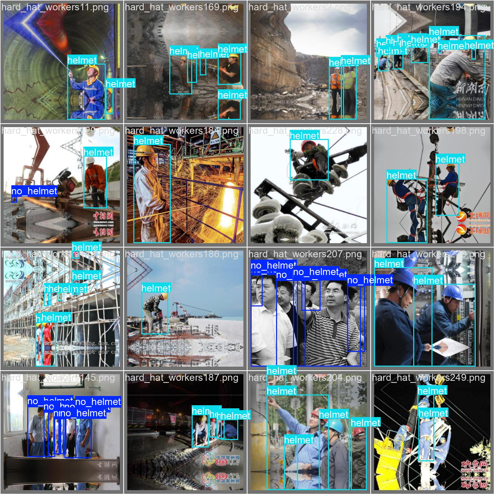
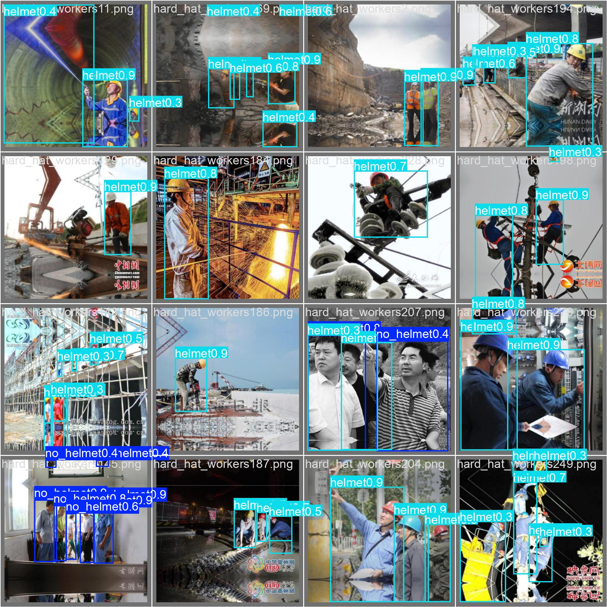
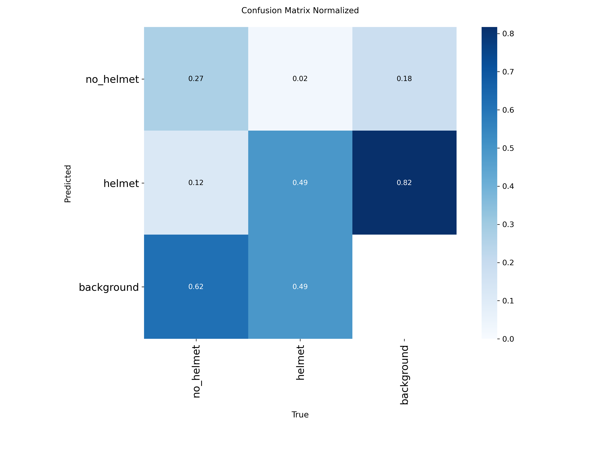
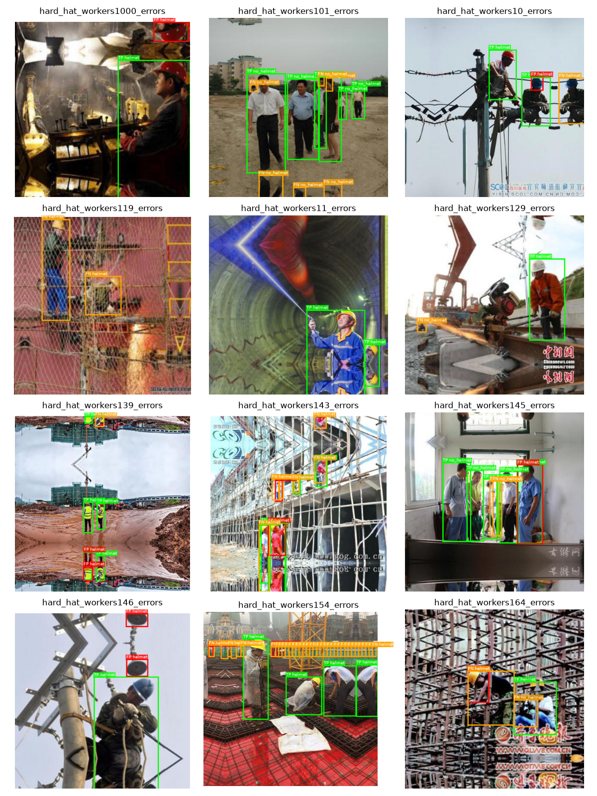

# Детекция людей без шлема

Разметка через VQA, потом дообучение YOLO. Метрика — mAP. Всё в `notebook.ipynb`.

## Как развернуть

Данные: [images.zip](https://code.s3.yandex.net/deep-learning-cv/images.zip) — распаковать в `images/`.

```bash
python -m venv .venv
source .venv/bin/activate
pip install -r requirements.txt
```

Ноутбук уже с выполненными ячейками. Цикл разметки, `prepare_dataset()` и `train()` закомментированы — полный прогон уже сделан.

Если размечать заново, поднять vLLM и открыть ноутбук:

```bash
vllm serve qwen/qwen3-vl-30b --trust-remote-code --limit-mm-per-prompt image=1 --port 1234
```

---

## Датасет

Качество изображений среднее, изображения небольшие. Часто снизу зеркальная склейка, поверх кадра встречаются водяные знаки. Шлемы разных цветов в разнообразных ракурсах. На изображениях иногда присутствуют толпы людей (>10 человек в кадре). VQA на таких кадрах скорее пропустит мелких людей в толпе, перепутает каску с её отсутствием или нарисует рамку на предмете и зеркальной склейке.

Для разметки взяли `qwen/qwen3-vl-30b`.

## Разметка VQA

Разметили **1001** кадр. Всего **10664** бокса: **3270** без шлема и **7394** в шлеме. Пустых файлов нет, на кадре от 1 до 40 человек.



- крупные люди в каске распознаются уверенно
- ошибка класса: человек в каске иногда помечается как без шлема
- ложные детекции — предметы принимаются за человека
- зеркало и водяной знак модель иногда игнорирует, иногда нет

Потолок обучения упирается в качество этой разметки.

## Обучение

Сплит 80/20. Модель — `yolo26n`, 100 эпох, размер изображения 512.

На обучении модель сходится. Метрики точности растут.

| Метрика | 1 эпоха | 100 эпоха |
| :--- | :---: | ---: |
| train/box_loss | 1.83 | 1.48 |
| train/cls_loss | 3.53 | 1.30 |
| **mAP50** | 0.24 | **0.41** |
| **mAP50-95** | 0.13 | **0.24** |

Лучший mAP50 — **0.418** на эпохе 49, дальше плато. На последней эпохе precision ≈ 0.68, recall ≈ 0.38.



По классам: **helmet AP50 = 0.49**, целевой **no_helmet AP50 = 0.33**, общий **mAP50 = 0.41**.



`val/cls_loss` к концу слегка растёт: после ~50 эпохи модель скорее подстраивается под ошибки меток.

Разметка vs предсказание на валидации:




## Ошибки



- `no_helmet`: только **27%** истинных срабатываний, **12%** путаются с `helmet`, **62%** уходят в фон — основной провал это пропуски, не путаница классов
- `helmet`: **49%** истинных срабатываний и **49%** пропусков, всего **2%** ошибочно определяются как `no_helmet`
- среди ложных срабатываний на фон почти все — лишние `helmet` (82%)



Зелёный — TP, красный — FP, оранжевый — FN.

- крупные люди в каске часто определяются правильно
- нет срабатываний: ночь и туннель, мелкие фигуры на краю, шумные композиции
- ложно-положительные: пустой фон, блики, дубли на одном человеке
- часть ошибок перешла от кривой разметки VQA, детектор её воспроизводит

## Выводы

Собрали разметку VQA и дообучили YOLO. Модель сходится и хорошо определяет крупных людей, особенно в каске.

По целевому классу `no_helmet` модель не слишком бдительна, а наоборот допускает ошибку второго рода. Из реальных людей без шлема она находит только 27%, ещё 12% путает с каской, 62% неверно определяет как фон. Ложных тревог мало: человек в каске становится `no_helmet` лишь в 2% случаев, а лишние боксы на фоне почти все — `helmet` (82%). Precision 0.68 при recall 0.38 это подтверждает.

Для улучшения имеет смысл поработать с датасетом:

- расширение через трансформации
- ручная коррекция разметки после VQA
- убрать слишком мелкие боксы и дубли
- поправить баланс классов: без шлема заметно реже, чем в шлеме
